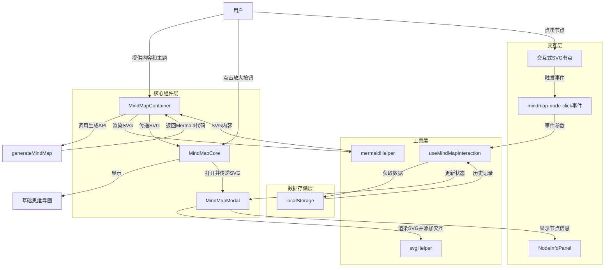

# 思维导图节点交互功能实现总结

## 项目架构概览

本项目实现了一个交互式思维导图功能，使用户能够点击节点查看相关记录，并将来支持节点的动态扩展。系统基于React组件架构和自定义钩子实现了良好的关注点分离。

## 目录结构

```
/components/mindmap/
  ├── MindMapContainer.js        # 主容器组件，负责状态管理和API调用
  ├── MindMapCore.js             # 核心渲染组件，负责基础思维导图显示
  ├── MindMapModal.js            # 模态框组件，负责交互式视图
  ├── components/
  │   └── NodeInfoPanel.js       # 节点信息面板，显示点击节点的相关记录
  ├── hooks/
  │   ├── useMermaid.js          # Mermaid库初始化和加载
  │   ├── useMindMapInteraction.js # 处理节点交互和数据检索
  │   └── useMindMapRenderer.js  # 处理SVG渲染和DOM操作
  └── utils/
      ├── codeExtractor.js       # 提取Mermaid代码
      ├── formatHelper.js        # 格式化辅助函数
      ├── formatter.js           # 代码格式化工具
      ├── mermaidHelper.js       # Mermaid渲染辅助工具
      ├── svgHelper.js           # SVG交互处理工具
      └── svgUtils.js            # SVG通用工具函数
```

## 核心组件职责

### MindMapContainer

作为容器组件，负责以下核心职责：

- 管理思维导图整体状态（加载、错误、处理中）
- 协调API调用生成思维导图
- 维护SVG内容并传递给子组件
- 控制模态框的显示与隐藏

### MindMapCore

作为思维导图的基础显示组件：

- 渲染基本思维导图视图
- 提供放大按钮打开模态框
- 显示加载状态和错误信息

### MindMapModal

作为交互式思维导图模态框组件：

- 提供全屏查看思维导图的界面
- 集成节点点击交互功能
- 显示与所选节点相关的记录信息

## 数据流与信息传递

### 思维导图生成流程

1. MindMapContainer 接收内容和主题参数
2. 调用 generateMindMap 生成Mermaid代码
3. 使用 mermaidHelper 渲染SVG内容
4. SVG内容传递给 MindMapCore 进行基础显示
5. 用户点击扩展按钮时，SVG内容传递给 MindMapModal

### 节点交互流程

1. useMindMapRenderer 使用 svgHelper 为SVG节点添加交互性
2. 节点点击时，svgHelper 中的 addClickEventToElement 函数：
   - 提取节点ID和文本
   - 创建并分发 mindmap-node-click 自定义事件
3. useMindMapInteraction 钩子监听 mindmap-node-click 事件
4. 事件触发时，检索相关记录：
   - 从 localStorage 中获取历史记录
   - 筛选与节点文本相关的记录
   - 更新状态变量 lastClickedNode 和 relatedRecords
5. MindMapModal 根据状态渲染 NodeInfoPanel 显示相关记录

## 思维导图数据流向图



## 关键技术点

### 1. SVG交互增强

Mermaid生成的SVG本身不支持交互，通过以下步骤实现了节点点击功能：

- 渲染后处理SVG DOM元素
- 为节点添加自定义事件处理
- 使用节点选择器(node、flowchart-node等)确保适配不同类型的图表
- 添加视觉反馈效果(hover状态、指针样式)

### 2. 事件系统设计

使用自定义事件实现组件间通信，而非直接的props传递：

- mindmap-node-click 事件携带节点ID和文本内容
- 全局事件监听简化了组件间数据流
- 规避了组件嵌套过深导致的prop钻取问题

### 3. 数据获取与关联

为实现节点与相关记录的关联：

- 使用不区分大小写的文本匹配
- 检查内容和主题两个字段
- 自适应处理不同节点文本内容格式

## 实现成果

### 节点信息收集功能

本次开发成功实现了思维导图节点信息的多维度收集功能：

1. **思维导图原始数据提取**
   - 从 localStorage 中获取完整的 Mermaid 代码
   - 正确处理存储格式与验证问题
   - 显示思维导图创建时间和标题信息

2. **背景信息关联**
   - 自动获取与当前思维导图相关的背景信息
   - 支持多种存储键的备选方案

3. **历史记录摘要**
   - 提取所有相关历史记录中的主要观点(Main Points)
   - 建立节点文本与历史记录的关联关系

4. **节点层级结构**
   - 实现简单节点信息记录和展示
   - 为未来的节点层级分析奠定基础

### 数据存储机制优化

针对思维导图数据存储的问题，实现了专用的存储函数：

- 创建 `saveMindMapDataToLocalStorage` 专用函数
- 解决了数据验证模式与思维导图数据结构不匹配的问题
- 确保思维导图数据能够正确持久化并在点击节点时检索

### 交互事件流程完善

现在节点点击时的完整流程如下：

1. 节点点击事件触发 `mindmap-node-click` 自定义事件
2. `useMindMapInteraction` 钩子接收事件并处理：
   - 获取相关历史记录
   - 获取背景信息
   - 获取完整 Main Point 列表
   - 获取思维导图原始数据
3. 信息聚合后可用于 NodeInfoPanel 显示，也为未来节点扩展提供完整上下文

这些功能为后续实现节点动态扩展功能奠定了坚实的技术基础和数据准备。

## 未来工作

根据规划文档，后续将实现以下功能：

- 节点扩展功能：点击节点时自动生成子节点内容
- 节点数据提取机制：完善从思维导图提取节点结构
- 增量更新算法：无缝合并新生成的分支
- 状态管理优化：支持撤销/重做和历史记录
- 性能优化：缓存机制和渲染性能提升

## 当前挑战与解决方案

### Mermaid代码提取问题

**挑战**：无法可靠地从SVG内容中提取原始Mermaid代码  
**解决方案**：采用直接操作SVG DOM的方式添加交互性，而非重新渲染

### 节点文本提取准确性

**挑战**：不同类型节点结构差异导致文本提取困难  
**解决方案**：实现getNodeRealText多策略提取文本内容

### 文本匹配相关性

**挑战**：简单文本匹配可能导致不相关记录被检索  
**解决方案**：未来可考虑实现更复杂的语义相似度算法

---

本项目通过组件化设计和清晰的职责分离，成功实现了思维导图的交互功能。自定义事件系统和SVG处理工具提供了良好的可扩展性基础，为未来节点动态扩展功能奠定了技术基础。