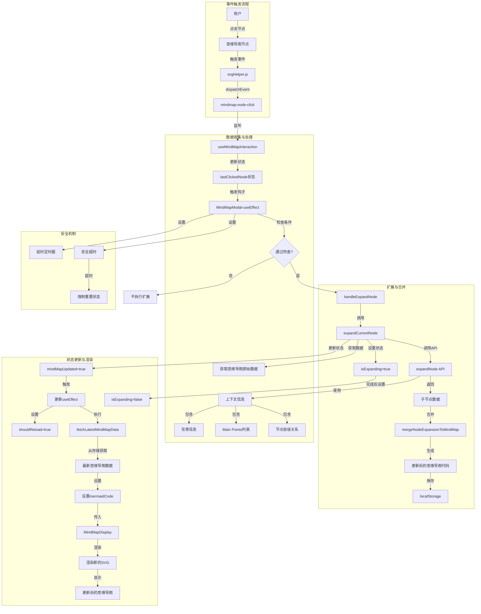
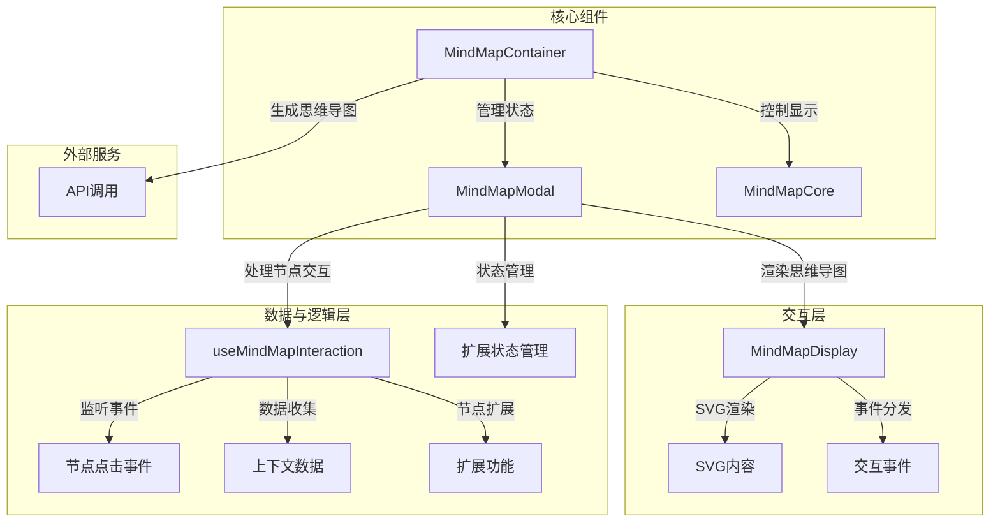

# 思维导图节点扩展功能实现总结

## 项目概述

本项目在原有思维导图显示功能的基础上，增加了节点动态扩展能力。用户可以点击思维导图中的节点，系统自动分析节点内容并动态生成相关子节点，扩充思维导图的内容深度。整个过程无需额外确认步骤，提供流畅的用户体验。

## 核心功能与成果

### 1. 全自动节点扩展

成功实现了思维导图节点的自动扩展功能：
- 用户点击节点后，系统无需额外确认，自动开始扩展流程
- 扩展过程中有清晰的视觉反馈（加载状态指示）
- 扩展完成后自动重新渲染思维导图

### 2. 优化的状态管理

为确保良好的用户体验，实现了完善的状态管理机制：
- 使用 ref 跟踪已扩展节点，避免重复扩展相同节点
- 通过时间间隔控制（1.5秒），防止短时间内的重复操作
- 添加多层安全检查机制，避免系统陷入永久加载状态

### 3. 数据集成与上下文分析

节点扩展功能充分整合了现有信息资源：
- 提取原始思维导图结构和节点层级关系
- 获取与主题相关的历史记录和背景信息
- 利用节点文本和相关记录进行内容扩展

## 数据流向详解

### 节点点击与扩展流程

1. **节点点击事件触发**
   - 用户点击思维导图中的节点
   - `svgHelper.js` 中的 `addClickEventToElement` 函数捕获点击事件
   - 创建并分发 `mindmap-node-click` 全局自定义事件

2. **事件处理与数据收集**
   - `useMindMapInteraction` 钩子监听 `mindmap-node-click` 事件
   - `handleNodeClick` 函数处理事件，更新 `lastClickedNode` 状态
   - `fetchKeyInformation` 函数收集节点相关信息：
     - 从 localStorage 获取背景信息
     - 从 localStorage 获取相关历史记录
     - 获取思维导图原始数据和节点层级关系

3. **节点自动扩展触发**
   - `MindMapModal` 组件通过 `useEffect` 监听 `lastClickedNode` 变化
   - 进行一系列条件检查（防重复、时间间隔控制等）
   - 符合条件后调用 `handleExpandNode` 函数

4. **扩展执行与内容生成**
   - `handleExpandNode` 调用 `expandCurrentNode`
   - `expandCurrentNode` 内部调用 `expandNode` 实用函数
   - `expandNode` 基于收集的上下文信息生成子节点
   - 子节点通过 `mergeNodeExpansionToMindMap` 合并到原思维导图

5. **状态更新与重新渲染**
   - 更新后的思维导图保存到 localStorage
   - 设置 `mindMapUpdated` 为 true 触发更新流程
   - `MindMapModal` 组件监听到更新，设置 `shouldReload` 为 true
   - 通过 `fetchLatestMindMapData` 获取最新数据并设置 `mermaidCode`
   - 最终 `MindMapDisplay` 组件根据新的 `mermaidCode` 重新渲染思维导图

## 思维导图节点扩展数据流向图

### 关键数据流转换
[用户点击节点] → [节点信息提取] → [收集上下文数据] → [生成子节点] → [合并到原图] → [保存更新后的图] → [触发重新渲染] → [显示更新后的思维导图]

## 技术挑战与解决方案

### 1. 状态管理复杂性

**挑战**：节点扩展过程涉及多个异步操作和状态变化，容易导致状态混乱或死锁

**解决方案**：
- 实现多层次状态检查机制避免冲突
- 使用 ref 跟踪长期状态（如已扩展节点）
- 添加多重超时保护机制防止无限加载
- 通过时间戳控制操作频率

### 2. 渲染刷新问题

**挑战**：更新后的思维导图不能保证正确重新渲染

**解决方案**：
- 为 MindMapDisplay 组件添加动态 key 值强制重新渲染
- 实现清晰的渲染状态流转（idle → loading → rendering → complete）
- 添加渲染开始和完成的回调处理

### 3. 交互流畅性

**挑战**：直接扩展可能导致用户体验不佳或意外操作

**解决方案**：
- 为扩展过程添加适度的延迟（300ms）避免意外触发
- 实现明确的加载状态指示器
- 通过节点状态跟踪避免重复扩展

## 代码优化经验

### 成功实践

1. **关注点分离**
   - 将节点交互逻辑封装在专用钩子中
   - 使用组合模式分离渲染和交互职责

2. **状态管理优化**
   - 使用 ref 存储不需要触发重渲染的状态
   - 延迟处理机制避免高频率状态更新

3. **安全机制设计**
   - 多层次超时保护确保系统稳定性
   - 完整的错误处理和恢复机制

### 教训与改进方向

1. **代码冗余**
   - 存在多处类似的状态检查逻辑，应考虑进一步抽象
   - 时间管理函数可以统一到公共工具中

2. **调试难度**
   - 异步操作链过长导致调试困难
   - 应考虑引入更结构化的状态机制

3. **性能优化空间**
   - 节点信息收集过于频繁，可以考虑缓存策略
   - localStorage 操作较多，可能影响性能

## 未来工作

1. **智能扩展改进**
   - 基于语义相似度优化子节点生成
   - 实现更智能的节点关联和扩展算法

2. **交互体验优化**
   - 添加节点扩展历史和回溯功能
   - 支持选择性扩展和扩展深度控制

3. **性能与稳定性**
   - 优化渲染性能，尤其是大型思维导图
   - 实现更健壮的错误恢复机制

## 技术架构与组件关系

