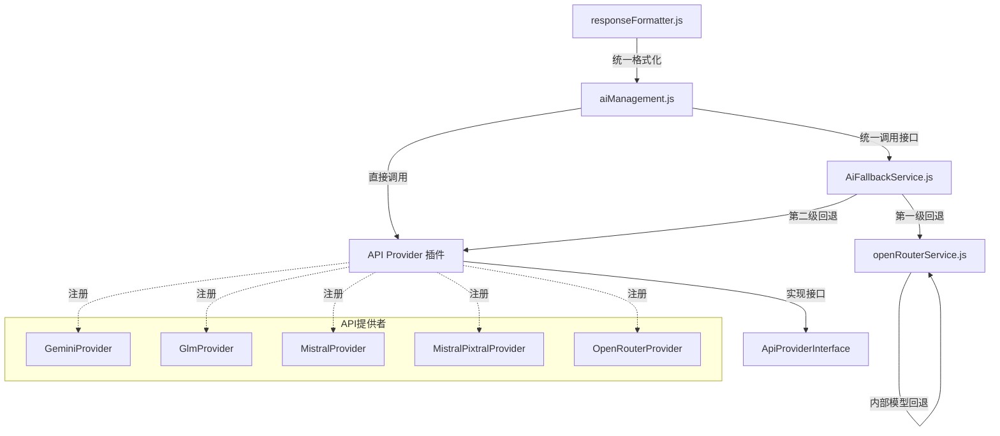

# AI 服务调用架构文档

## 概述

本文档详细介绍了应用程序的 AI 服务调用架构，包括多级回退机制、API 提供者插件系统和统一调用接口。该架构采用模块化设计，实现了高度可扩展、可维护和容错的 AI 服务调用系统。

## 架构设计

### 架构图



### 核心组件

#### 1. aiManagement.js - 系统核心

- 提供统一的 AI 调用接口 `callAI()`
- 负责 API 类型的选择逻辑
- 将请求路由到相应的 API 提供者
- 集中处理配置和环境变量

#### 2. AiFallbackService.js - 高级回退策略

- 实现多级回退机制
- 首先尝试 OpenRouter 内部回退
- OpenRouter 失败后尝试其他 API
- 按优先级排序尝试备选 API

#### 3. openRouterService.js - OpenRouter 专用服务

- 实现 OpenRouter API 内部模型回退
- 处理特定于 OpenRouter 的请求逻辑
- 管理模型优先级和切换策略

#### 4. ApiProviderInterface.js - API 提供者接口

- 定义标准化的 API 提供者接口
- 提供插件创建工具 `createApiProvider()`
- 确保所有提供者实现一致的方法

#### 5. ApiRegistry.js - API 提供者注册中心

- 管理所有已注册的 API 提供者
- 提供动态注册和查找功能
- 实现默认 API 的配置管理

#### 6. providers/ - API 提供者实现

- 包含各种 API 实现（Gemini、GLM、Mistral 等）
- 每个提供者负责自己的 API 调用和响应处理
- 封装特定 API 的认证和参数处理

#### 7. responseFormatter.js - 响应格式化服务

- 标准化不同 API 的响应格式
- 提供统一的错误处理
- 确保客户端接收一致的数据结构

## 多级回退机制

该系统实现了两级回退策略，确保 AI 服务的可用性和稳定性：

### 第一级回退 - OpenRouter 内部模型回退

由 `openRouterService.js` 中的 `callOpenRouterWithFallback` 函数实现：

1. 首先尝试用户指定的主要 OpenRouter 模型
2. 若失败，按预定义优先级尝试备选 OpenRouter 模型
3. 记录并返回所使用的模型信息
4. 详细记录每次模型切换和错误原因

### 第二级回退 - 外部 API 回退

由 `AiFallbackService.js` 中的 `executeWithFallbackStrategy` 函数实现：

1. 在 OpenRouter 所有模型均失败时触发
2. 按优先级顺序尝试其他 API 提供者（通常为 Gemini > Mistral > GLM）
3. 记录回退路径和使用的 API 类型
4. 为每次回退附加原始请求上下文

## API 提供者插件系统

该系统采用插件架构，使添加新的 AI 服务变得简单和标准化：

### 接口定义

```javascript
// API提供者必须实现的标准接口
{
  type: string,           // API类型标识符 (如 'gemini', 'glm')
  name: string,           // 友好名称 (如 'Google Gemini')
  supportsFallback: boolean,  // 是否支持作为回退选项
  callApi: Function,      // API调用方法
  formatResponse: Function,   // 响应格式化方法
  getDefaultConfig: Function  // 获取默认配置
}
```

### 创建新的 API 提供者

要添加新的 API，只需创建一个新的提供者模块并实现标准接口：

```javascript
// 新API提供者示例
import { createApiProvider } from '../ApiProviderInterface';

export const NewProvider = createApiProvider({
  type: 'new-api',
  name: 'New AI Service',
  supportsFallback: true,
  
  callApi: async (text, options) => {
    // 实现API调用逻辑
    return response;
  },
  
  formatResponse: (response) => {
    // 实现响应格式化逻辑
    return standardizedResponse;
  },
  
  getDefaultConfig: () => ({
    apiKey: process.env.REACT_APP_NEWAPI_API_KEY,
    endpoint: 'https://api.newservice.com/v1/chat',
    // ...其他配置
  })
});
```

### 注册 API 提供者

在 `ApiRegistry.js` 中导入并注册新的提供者：

```javascript
import { registerProvider } from './ApiRegistry';
import { NewProvider } from './providers/NewProvider';

// 注册新提供者
registerProvider(NewProvider);
```

## 统一调用接口

客户端代码通过 `aiManagement.js` 提供的统一接口调用 AI 服务：

```javascript
import { callAI } from '../services/aiManagement';

// 使用当前默认或指定的API
const response = await callAI('请总结以下文本：' + text);

// 指定特定API
const response = await callAI(text, 'gemini', { temperature: 0.7 });

// 处理响应
const formattedResponse = formatResponse(response);
console.log(formattedResponse.text);
```

## 错误处理与日志

系统在各层实现了完整的错误处理和日志机制：

- **详细的错误信息**：每个错误包含 API 类型、状态码和原始错误消息
- **多级捕获**：在不同层捕获和记录错误，确保上下文完整
- **错误日志**：使用 `console.error` 记录详细的错误信息
- **回退日志**：记录所有回退操作和路径
- **性能日志**：记录 API 调用时间和响应大小
- **模型使用统计**：跟踪不同模型的使用频率和成功率

## 配置管理

系统使用集中式配置管理，通过依赖注入传递配置：

- 配置仅在 `aiManagement.js` 中从 `apiConfig.js` 导入
- 通过函数参数将配置传递给下层服务
- 每个 API 提供者通过 `getDefaultConfig()` 方法提供自己的配置
- 使用环境变量存储敏感信息（API密钥等）

### 配置示例

```javascript
// apiConfig.js
export const OPENROUTER_CONFIG = {
  apiKey: process.env.REACT_APP_OPENROUTER_API_KEY,
  endpoint: 'https://openrouter.ai/api/v1/chat/completions',
  model: 'nvidia/llama-3.1-nemotron-ultra-253b-v1:free',
  fallbackModels: [
    'deepseek/deepseek-r1:free',
    'qwen/qwen-2.5-7b-instruct:free',
    'nvidia/llama-3.3-nemotron-super-49b-v1:free'
  ],
  siteUrl: 'https://lazydog-app.com',
  siteName: 'LazyDog Speech Recognition',
  defaultParams: {
    temperature: 0.7,
    max_tokens: 1024
  }
};
```

## 响应处理与标准化

系统将不同 API 的响应格式标准化为统一格式：

```javascript
// 标准化响应格式
{
  text: string,           // 提取的文本内容
  rawResponse: object,    // 原始API响应
  apiType: string,        // 使用的API类型
  fallbackUsed: boolean,  // 是否使用了回退
  originalApiType: string, // 原始API类型（如果发生回退）
  usedModel: string,      // 使用的模型（仅适用于OpenRouter）
  error?: string          // 错误信息（如果有）
}
```

## 最佳实践与使用示例

### 标准 API 调用

```javascript
import { callAI, formatResponse } from '../services/aiManagement';

async function optimizeText(text) {
  try {
    // 使用当前默认API
    const response = await callAI(`请优化以下文本：${text}`);
    const result = formatResponse(response);
    return result.text;
  } catch (error) {
    console.error('文本优化失败:', error);
    return '处理请求时出错，请稍后再试。';
  }
}
```

### 自定义优先级

要更改回退优先级，修改 `AiFallbackService.js` 中的优先级列表：

```javascript
// 自定义API回退优先级
const priorityOrder = ['gemini', 'glm', 'mistral']; // 将GLM提升至第二位
providers.sort((a, b) => {
  const indexA = priorityOrder.indexOf(a.type);
  const indexB = priorityOrder.indexOf(b.type);
  return (indexA === -1 ? 999 : indexA) - (indexB === -1 ? 999 : indexB);
});
```

### 添加自定义日志

```javascript
// 在aiManagement.js中添加详细日志
const response = await provider.callApi(text, options);
console.log(`API响应成功 [${provider.type}]: 大小=${JSON.stringify(response).length} 字节`);
if (response.usedModel) {
  console.log(`使用的模型: ${response.usedModel}`);
}
return response;
```

## 安全考虑

本架构采取以下安全措施：

- **API密钥保护**：所有密钥通过环境变量管理，不硬编码
- **错误消息净化**：对外展示的错误信息经过处理，不泄露敏感信息
- **请求限制**：实现频率限制，防止API滥用
- **响应验证**：验证API响应格式和内容，防止注入攻击

## 性能优化

- **缓存机制**：对相同或相似请求实现结果缓存
- **请求合并**：在高峰期合并相似请求减少API调用
- **响应流处理**：支持流式响应处理大型文本
- **资源管理**：监控并限制并发API请求数量

## 未来扩展计划

1. **智能路由**：基于历史性能和可用性动态选择最佳API
2. **A/B测试框架**：评估不同模型和配置的效果
3. **用量监控仪表板**：提供API使用情况和性能可视化
4. **本地模型集成**：支持本地运行的小型模型作为应急回退选项
5. **自定义模型适配器**：允许用户提供自己的模型API适配器

## 总结

本文档介绍的 AI 服务调用架构提供了：

- **高可靠性**：通过多级回退策略确保服务可用性
- **高扩展性**：通过插件系统支持轻松添加新API
- **高一致性**：提供统一的调用接口和响应格式
- **高可维护性**：采用模块化设计，分离关注点
- **高灵活性**：支持动态配置和优先级调整

开发者可以专注于使用统一接口，无需关心底层实现细节，同时系统能够智能地处理各种错误情况并保持服务连续性。

## 添加新 API 提供者的最佳实践

在将新的 AI API 集成到系统时，可能会遇到一些常见问题。以下是基于实际经验的注意事项和解决方案：

### 常见问题与解决方案

#### 1. 响应格式不一致

**问题**: 不同 API 提供者返回的响应格式可能不一致，导致后续处理出错。例如，添加 xAI/Grok API 时，它的 `formatResponse` 方法返回的是 `content` 属性而不是其他提供者使用的 `text` 属性。

**症状**:
```
TypeError: Cannot read properties of undefined (reading 'replace')
```

**解决方案**:
- 在 `formatResponse` 方法中同时返回 `text` 和 `content` 属性，保持与其他提供者一致:
```javascript
return {
  content: content || '无内容返回',
  text: content || '无内容返回', // 添加与其他provider一致的字段
  rawResponse: response,
  apiType: this.type,
  usedModel: response.usedModel || API_CONFIG.model
};
```
- 在系统中处理响应格式的地方添加兼容性检查，优先使用 `text` 或 `content`

#### 2. 配置文件不同步

**问题**: 在不同文件中定义了相同的配置（如默认 API 类型），但修改时没有同步更新所有位置。

**症状**: 更改默认 API 后系统行为与预期不符。

**解决方案**:
- 遵循单一来源原则，只在 `apiConfig.js` 中定义配置
- 其他文件通过导入使用这些配置:
```javascript
import { API_TYPES, DEFAULT_API } from '../../config/apiConfig';
```
- 避免在注释和代码之间出现不一致（如 `DEFAULT_API = API_TYPES.XAI; // Setting OpenRouter as the default API`）

#### 3. 错误处理不完善

**问题**: API 调用过程中的错误没有得到充分处理，导致异常传播到应用程序其他部分。

**症状**: 应用程序崩溃或显示不友好的错误消息。

**解决方案**:
- 在每个 API provider 中实现完整的错误处理，捕获所有可能的异常
- 返回带有错误标志的标准化响应对象:
```javascript
try {
  // API 调用逻辑
} catch (error) {
  return {
    text: '处理请求时出错',
    content: '处理请求时出错',
    error: true,
    errorMessage: error.message
  };
}
```

### 新 API 提供者实现检查清单

添加新 API 提供者时，使用以下检查清单确保实现符合系统要求:

1. **接口完整性**: 实现所有必需方法 (`callApi`, `formatResponse`, `getDefaultConfig`)
2. **返回格式一致性**: 确保 `formatResponse` 返回包含 `text` 属性的对象
3. **错误处理**: 实现完整的错误捕获和处理逻辑
4. **日志记录**: 添加适当的日志记录，帮助调试问题
5. **配置独立性**: 使用自己的配置对象，避免与其他提供者共享配置
6. **认证处理**: 正确处理 API 密钥和认证头部
7. **回退支持**: 设置 `supportsFallback` 标志，指示是否支持作为回退选项

### 新 API 添加后的测试策略

添加新 API 提供者后，执行以下测试确保集成成功:

1. **基本调用测试**: 验证能够成功调用新 API 并接收响应
2. **错误处理测试**: 通过提供无效输入或禁用 API 密钥测试错误处理
3. **回退测试**: 如果配置为回退选项，测试在主 API 失败时是否正确触发
4. **格式化测试**: 验证响应格式化是否符合系统要求
5. **边界条件测试**: 测试空输入、超长输入、特殊字符等边界情况